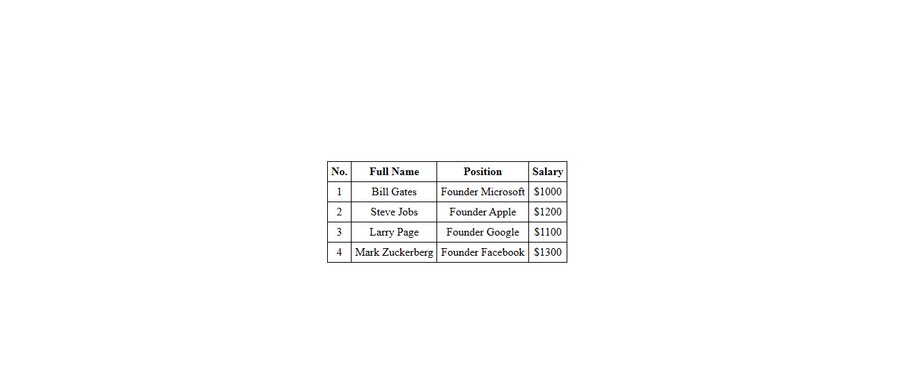

# HTML-Table
Employee Table
This is a simple HTML table displaying information about employees, including their No., Full Name, Position, and Salary.

How to Use
1.Clone the repository or download the index.html file.
2.Open the index.html file in your web browser.

