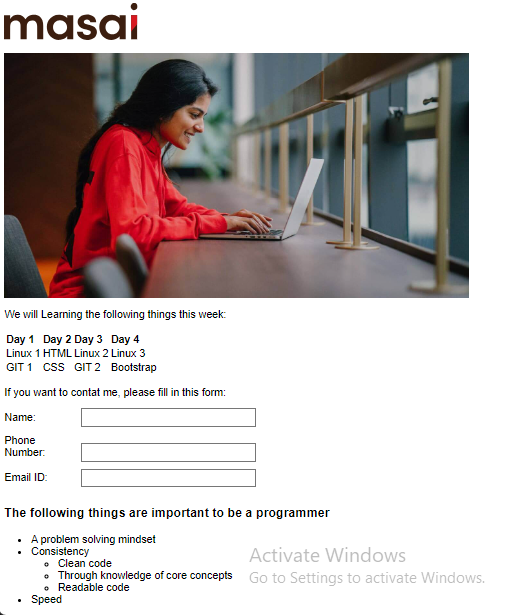

# Masai-Layout-Sample

To run the webpage locally, follow these steps:

1.Clone the repository or download the files.

2.Open the "index.html" file in your web browser.

3.You should now see the "Masai Sample Layout" webpage with all the sections and content.

